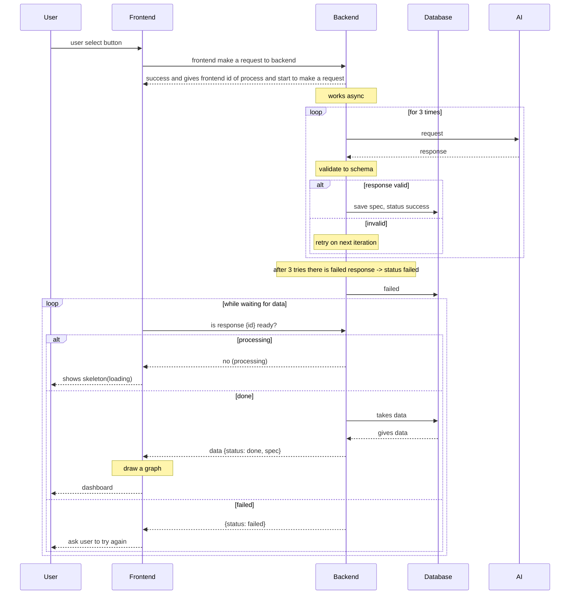

```mermaid
sequenceDiagram
participant U as User
participant F as Frontend
participant B as Backend
participant DB as Database
participant AI as AI


U ->> F: user select button
F ->> B: frontend make a request to backend
B -->> F: success and gives frontend id of process and start to make a request

Note over B: works async
loop for 3 times
    B->> AI: request
    AI -->> B: response
    Note over B: validate to schema
    alt response valid
        B ->> DB: save spec, status success
    else invalid
        Note over B: retry on next iteration
    end
end
Note over B: after 3 tries there is failed response -> status failed
B ->> DB: failed


loop while waiting for data
    F ->> B: is response {id} ready?
    alt processing
        B -->> F: no (processing)
        F -->> U: shows skeleton(loading)
    else done
        B ->> DB: takes data
        DB -->> B: gives data
        B -->> F: data {status: done, spec}
        Note over F: draw a graph
        F -->> U: dashboard
    else failed
        B -->> F: {status: failed}
        F -->> U: ask user to try again
    end
end
```
